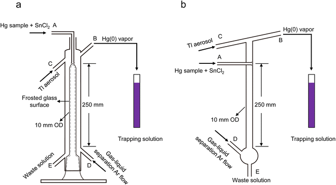
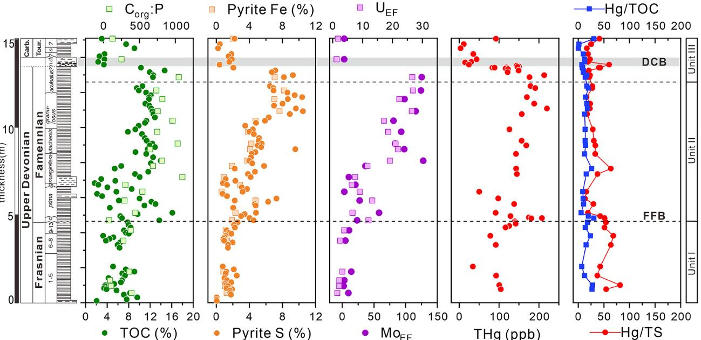
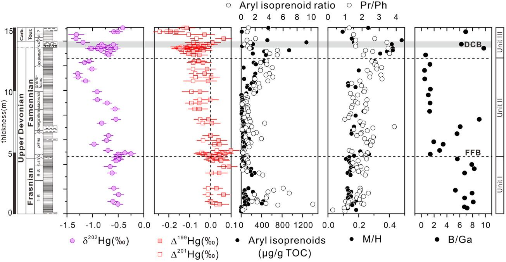

# 
Mercury isotope evidence for recurrent photic-zone euxinia triggered by enhanced terrestrial nutrient inputs during the Late Devonian mass extinction[1]

# 
汞同位素揭示了晚泥盆纪陆源营养物质输入增强下增强背景下透光带硫化[1]

## **1.Background/背景**

&emsp;&emsp;The organic-rich black shale from the Frasnian-Famennian mass extension (FFB) was an essential event deposition in the Devonian-Carboniferous boundary (DCB), which is thought to be caused by deoxygenation. Possible reseaons for FFB include volcanism [2-4], continental weathering[5-6], tectonic activity[7], increasing UV radiative flux[8], oceanic anoxia event (OAE)[9-14]. Most researchers thought OAE would be the controlable index for FFB.

&emsp;&emsp;法尔斯阶-法门阶生物大灭绝（FF事件）中的富有机制黑色页岩是泥盆-石炭沉积转换期（DCB）重要的沉积标志，可能的诱因包含火山活动[2-4]、大陆风化[5-6]、构造活动[7]、紫外线辐射增加[8]、大洋缺氧事件（OAE）[9-14]，大部分学者认为OAE可能是主要的诱因。

&emsp;&emsp; Evidence from series geochemical analysis (sensitive trace elements, pyrite framboids and mental isotopes) of the shale in the FFB proved that the OAE maily controls the FFB. With the developments of lip biomarkers (green and brown sulfur becteria) researches[12,15], photic-zone euxinia (PZE) could decipher the shallow-margin OAE deeply[16]. However, multiple analysis for the volcansim and PZE is still absent. [1] took a new insight of FFB by Hg istopes analysis.

&emsp;&emsp;针对FFB黑色页岩大量氧化还原敏感元素、草莓状黄铁矿和金属同位素分析有效证明了OAE控制了FFB并导致了FFB黑色页岩的沉积。伴随着脂类生物标志化合物（棕绿硫化细菌）研究的发展，DBC期OAE浅海透光带缺氧（PEZ）得到了进一步揭示。然而，当前仍然针对PZE和火山活动的多指标地球化学分析。基于这种情况，[1] 有效利用了汞同位素作为桥梁对两者关系进行了深入研究。

## **2.Geochemical Analysis/地球化学分析**

### 2.1 Hg concentration analysis/全岩汞浓度分析

* Instrument: Lumex RA-915F+Lumex thermal pyrolysis unit
* 仪器：Lumexc汞元素分析仪+Lumex热解装置
* Experimental location: Tianjin University
* 实验地点：天津大学
* Experimental process: (1) Releasing solid Hg vapor by pyrolysis after heating into <b>750C&deg;</b>; (2) After cooling, the cold vapor atomic absorption spectroscopy analyzes the content of Hg
* 实验过程：（1）<b>750C&deg;</b> 加热岩石样品，热解释放固体汞；（2）利用冷凝蒸汽原子吸收质谱仪（CV-AAS）测量冷却的汞蒸汽，在假定岩石裂解完全的情况下，CV-AAS仪定结果可以近似代表岩石中汞元素含量。
* Standard sample: GSD-11, freash water sediemnts, average Hg concentration = 72.0 $\pm$ 7.4 ng$\cdot$g-1
* 标样：淡水沉积物GSD-11，平均汞含量72.0 $\pm$ 7.4 ng$\cdot$g-1

### 2.2 Hg isotope analysis/全岩汞同位素分析

* Instrument: multi-collector inductively coupled plasma mass spectrometry (MC-ICPMS, Neptune Plus, Thermo Scientific, and Nu plasma 3D, Nu instruments Ltd.)
* 仪器：Thermo Scientific Neptune Plus型多接收电感耦合等离子体质谱仪
* Experimental location: Tianjin University
* 实验地点：天津大学
* Experimental process[17]: (1) The bulk samples were desolved by 5% (v/v) HCl firstly and diluted by MQ, which ensuring that the Hg concentration > 1~2 ng$\cdot$g-1; (2) The second step is heating the Hg-enriched solution into <b>100C&deg;</b> for 48 hours; (3) Then utilize equipments in Fig. 1b and add SnCl2 solution (3%, v/v). The role of SnCl2 solution is to reduce Hg2+ in the last solution. The entrance of Hg gas-liquid flow is A in Fig.1b. The gained solution is gethered from entrance B in Fig.1b. Also, Tl aerosol is a neccessity added from entrance B in Fig.1b
* 实验方法：（1）用5%稀盐酸消解岩石样品，用超纯水进行稀释，保证稀释后溶液中汞元素浓度大于1~2 ng$\cdot$g-1；（2）<b>100C&deg;</b>加热溶液48小时；（3）从如图1b中所示A口加入溶液与3%SnCl2溶液的混合物，D口通入Ar气，C口通入Tl气溶胶，充分收集全岩样品中的固态汞。
* Isotopic representation: The Hg element has 5 types isotopes, including 199Hg, 200Hg, 201Hg, 202Hg and 204Hg. For one type *x* in Hg isotopes (represented as xHg), with the fraction of Hg isotope noted as "$\delta$Hg", the fraction of the *x* type of Hg isotope can be represented as:
$$
\delta^xHg=[(^xHg/^yHg)_a-^xHg/^yHg)_s]\times1000
$$
where *x* can be any Hg isotope, *y* is 198, *a* means the bulk samples and *s* means the standard samples.
In addition, the $\Delta$xHg is adapted more often, which can be calculated as:
$$
\Delta^xHg=\delta^xHg-(\delta^yHg\times\beta)
$$
where *x* can be any Hg isotope, *y* is 202, *$\beta$* is a scaling constant to estimate the theoretical kinetic isotope deviation. with a value of 0.2520, 0.5024, 0.7520, and 1.493 for 199Hg, 200Hg, 201Hg, and 204Hg, respectively.
* 同位素表示方法：自然界中汞元素包含5种同位素（199Hg, 200Hg, 201Hg, 202Hg以及 204Hg）。对于质量数为 *x* 的汞同位素（表示为 xHg），在汞同位素的分馏系数表示为 $\delta$Hg的情况下, 汞同位素分馏程度的计算可以表示为:
$$
\delta^xHg=[(^xHg/^yHg)_a-^xHg/^yHg)_s]\times1000
$$
其中，*x* 表示质量数为*x*的汞同位素, *y*是198, *a*表示待测试的全岩样品，*s*代表标样。
此外, the $\Delta$xHg在表示汞同位素测试时应用更为广泛，计算方式为:
$$
\Delta^xHg=\delta^xHg-(\delta^yHg\times\beta)
$$
其中， *x* 表示质量数为*x*的汞同位素, *y* 是202, *$\beta$* 是一个估计汞同位素动力学分馏的常数，针对 199Hg, 200Hg, 201Hg, and 204Hg的取值分别为0.2520，0.5024，0.7520以及1.493。
* Standard sample: NIST SRM 3133 mercury standard solution；NIST SRM 8610 ($\delta$202Hg=−0.52±0.09‰, $\Delta$199Hg=0.00±0.04‰, $\Delta$201Hg=−0.02±0.03‰, and $\Delta$200Hg=0.01±0.04‰); NIST SRM 1944 ($\delta$202Hg=−0.46±0.09‰, $\Delta$199Hg=0.01±0.04‰, $\Delta$201Hg=−0.01±0.03‰, and $\Delta$200Hg=0.02±0.04‰).
* 标样：NIST SRM 3133 mercury standard solution；NIST SRM 8610 ($\delta$202Hg=−0.52±0.09‰, $\Delta$199Hg=0.00±0.04‰, $\Delta$201Hg=−0.02±0.03‰, and $\Delta$200Hg=0.01±0.04‰); NIST SRM 1944 ($\delta$202Hg=−0.46±0.09‰, $\Delta$199Hg=0.01±0.04‰, $\Delta$201Hg=−0.01±0.03‰, and $\Delta$200Hg=0.02±0.04‰)。

<b>Fig.1 Pre-process before Hg isotope analysis[17](Pre-process methods of paper[1] is shown in Fig.1b); (a) Gas-liquid-seperater-1; (b) Gas-liquid-seperate-2</b>

<b>图1 汞同位素测试前预处理实验流程[17](文章[1]的汞同位素测试前处理方法见图1b); (a) 1型气液分离器; (b) 2型气液分离器</b>

## **3.Resuls/结果**
### 3.1 Chemostratigraphy/化学地层结果

<b>Fig.2 Pre-process before Hg isotope analysis[17](Pre-process methods of paper[1] is shown in Fig.1b); (a) Gas-liquid-seperater-1; (b) Gas-liquid-seperate-2</b>

<b>图1 汞同位素测试前预处理实验流程[17](文章[1]的汞同位素测试前处理方法见图1b); (a) 1型气液分离器; (b) 2型气液分离器</b>

<b>Fig.1 Pre-process before Hg isotope analysis[17](Pre-process methods of paper[1] is shown in Fig.1b); (a) Gas-liquid-seperater-1; (b) Gas-liquid-seperate-2</b>

<b>图1 汞同位素测试前预处理实验流程[17](文章[1]的汞同位素测试前处理方法见图1b); (a) 1型气液分离器; (b) 2型气液分离器</b>

## **Reference/参考文献**

 <b>[1] Zheng, W., Gilleaudeau, G. J., Algeo, T. J., et al. 2023.  Mercury isotope evidence for recurrent photic-zone euxinia triggered by enhanced terrestrial nutrient inputs during the Late Devonian mass extinction. Earth Planet. Sci. Lett. 613, 118175.<b>
 [2] Racki et al. 2018
 [3] Racki. 2020
 [4] Kaiho et al. 2021
 [5] Algeo et al. 1995
 [6] Algeo and Scheckler. 1998
 [7] Averbuch et al. 2005
 [8] Marshall et al. 2020
 [9] Caplan and Bustion, 1999
 [10] Marynowski et al. 2012
 [11] Liu et al. 2019
 [12] Song et al. 2021
 [13] Zhang et al. 2020
 [14] Sahoo et al. 2023
 [15] Kabanov and jiang. 2020
 [16] Whiteside and Grice. 2016
 [17] Shi, M., Bergquist, B. A., Zhou, A., et al. 2023. The efficiency of Hg cold vapor generation and its
influence on Hg isotope analysis by MC-ICP-MS. Journal of Analytical Atomic Spectrometry. 38, 1076-1087.
